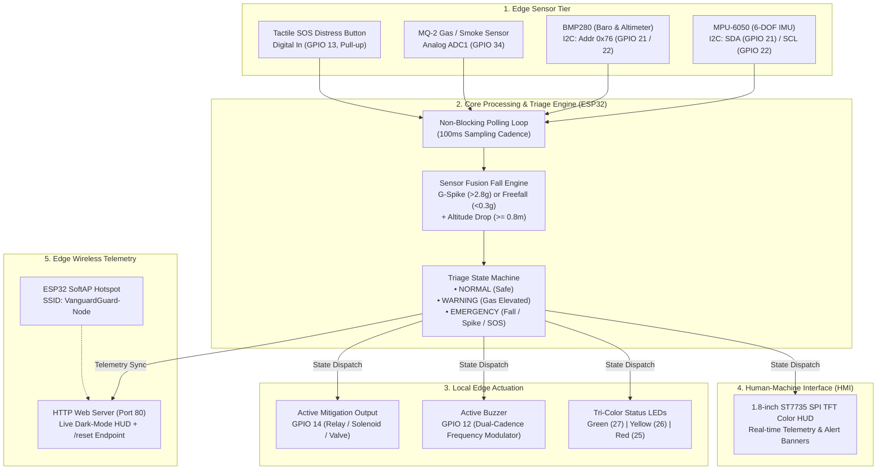

<div align="center">

# 🛡️ BARNSTROMZ // VanguardGuard
### **Next-Gen Industry 6.0 Active Mitigation & Worker Bio-Safety Wearable Node**

[](https://www.espressif.com/)
[](https://www.arduino.cc/)
[](https://invensense.tdk.com/)
[](https://www.bosch-sensortec.com/)
[]()
[]()
[]()
[]()
[]()

<p align="center">
  <b>Autonomous Edge-Computing Safety Node with Real-Time Biomechanical & Atmospheric Threat Detection, Multi-Sensor Fusion Triage, Local Hardware Mitigation, and Zero-Latency Mobile Telemetry.</b>
</p>

---

[Overview](#overview) •
[Key Highlights](#key-highlights) •
[System Architecture](#system-architecture) •
[Hardware Pinout](#hardware-pinout--schematics) •
[Triage Matrix](#triage-state-matrix) •
[Web Dashboard](#edge-web-dashboard) •
[Firmware Design](#firmware--logic-design) •
[Getting Started](#getting-started--flashing) •
[Roadmap](#future-roadmap)

---

</div>

## 📌 Overview

In high-hazard industrial spaces (chemical refineries, construction hubs, heavy assembly, and confined subterranean spaces), traditional worker safety wearables are **passive telemetry loggers**—they notify remote operators *after* trauma has already occurred.

**BARNSTROMZ (VanguardGuard Node)** shifts the paradigm from *passive reporting* to **autonomous edge-level active mitigation**. Built around the high-speed dual-core ESP32 microcontroller, BARNSTROMZ delivers sub-millisecond threat classification and directly executes physical hardware countermeasures (emergency ventilation triggering, valve cut-off, automated harness lock, or distress beacons) even in completely air-gapped or network-denied facilities.

---

## ⚡ Key Highlights

- 🪂 **Multi-Sensor Fusion Fall & Impact Detection**: Non-blocking continuous inertial monitoring via 6-axis **MPU-6050** fused with barometric elevation tracking via **BMP280**. Simultaneously flags sudden freefall states ($< 0.3g$) or destructive shock impacts ($> 2.8g$) combined with a confirmed vertical altitude drop ($\Delta h \ge 0.8\text{ m}$), eliminating false triggers from routine movements:
  $$\|G\| = \sqrt{a_x^2 + a_y^2 + a_z^2}, \quad \Delta h = h_{\text{baseline}} - h_{\text{current}} \ge 0.8\text{ m}$$
- 🏔️ **High-Precision Barometric Pressure & Altimetry**: Continuous ambient atmospheric pressure ($h\text{Pa}$) and dynamic relative altitude ($m$) monitoring using the **BMP280** over shared I2C (`0x76`) with 16x oversampling and IIR filtering.
- ☣️ **Multi-Tier Toxic & Combustible Gas Triage**: Continuous atmospheric sampling via **MQ-2** sensor with ADC-based hysteresis to differentiate between ambient baseline deviations (Warning) and lethal runaway gas spikes (Emergency).
- 🚨 **Autonomous Hardware Mitigation Actuator**: High-priority hardware driver line (`GPIO 14`) engineered to instantly engage mechanical mitigations (solenoid valves, emergency servos, harness dampers, or high-power strobes) without waiting for cloud round-trips.
- 📺 **Onboard 1.8" ST7735 High-Contrast Color TFT HUD**: Dynamic, context-aware GUI providing instant visual triage (Safe, Warning, Critical Hazard Invert), live vector acceleration, relative altitude, and raw gas concentration readouts with non-flicker background-fill refresh.
- 🔴 **Tri-Color LED & Dual-Cadence Acoustic Siren**: Instant physical status indication (Green/Yellow/Red) accompanied by dynamic buzzer modulation (slow pulse on warning, high-frequency panic bursts on critical emergency).
- 🆘 **Deterministic Tactile Distress Trigger**: Direct tactile push button (`GPIO 13`) with software debouncing for immediate manual SOS override.
- 🌐 **Zero-Dependency SoftAP Web Dashboard**: Onboard captive Wi-Fi Access Point (`VanguardGuard-Node`) hosting a lightweight, dark-mode real-time responsive dashboard with one-touch alarm reset reachable from any smartphone, tablet, or rugged industrial terminal with zero external infrastructure.

---

## 🏗️ System Architecture



---

## 🔌 Hardware Pinout & Schematics

The firmware is targeted for the **ESP32 DevKit V1 (30-pin / 36-pin)**. All hardware buses are strictly separated to prevent contention between SPI and I2C peripherals.

### Complete Pin Allocation Table

| Peripheral | Component Pin | ESP32 GPIO | Mode / Bus | Description / Technical Notes |
| :--- | :--- | :--- | :--- | :--- |
| **ST7735 TFT** | `CS` | **GPIO 5** | Output (SPI) | Chip Select Line |
| **ST7735 TFT** | `RST` | **GPIO 4** | Output | Display Hardware Reset Line |
| **ST7735 TFT** | `DC / A0` | **GPIO 2** | Output | Data / Command Select |
| **ST7735 TFT** | `SDA / MOSI`| **GPIO 23** | SPI Master | Hardware VSPI MOSI line |
| **ST7735 TFT** | `SCK / CLK` | **GPIO 18** | SPI Master | Hardware VSPI Clock line |
| **ST7735 TFT** | `VCC / LED` | **3.3V / 5V** | Power | Backlight & Logic Power Supply |
| **ST7735 TFT** | `GND` | **GND** | Ground | Common System Ground |
| **MPU-6050** | `SDA` | **GPIO 21** | I2C Data | Default ESP32 I2C Data Bus |
| **MPU-6050** | `SCL` | **GPIO 22** | I2C Clock | Default ESP32 I2C Clock Bus |
| **MPU-6050** | `VCC / GND` | **3.3V / GND** | Power | Accelerometer/Gyroscope Bus Power |
| **BMP280** | `SDA` | **GPIO 21** | I2C Data | Shared ESP32 I2C Data Bus (Address `0x76`) |
| **BMP280** | `SCL` | **GPIO 22** | I2C Clock | Shared ESP32 I2C Clock Bus (Address `0x76`) |
| **BMP280** | `VCC / GND` | **3.3V / GND** | Power | High-Precision Altimeter & Barometer Power |
| **MQ-2 Sensor** | `AOUT` | **GPIO 34** | Analog In | ADC1 Channel 6 (No Wi-Fi ADC conflict) |
| **MQ-2 Sensor** | `VCC / GND` | **5.0V / GND** | Power | Sensor Heater Requires Stable 5V Rail |
| **SOS Button** | Signal | **GPIO 13** | Input Pull-Up | Active LOW tactile panic push button |
| **Mitigation** | Trigger | **GPIO 14** | Digital Out | Active HIGH driver for Relay / Solenoid / Servo |
| **Active Buzzer**| Signal | **GPIO 12** | Digital Out | Modulated acoustic siren |
| **Status Green**| Anode (+) | **GPIO 27** | Digital Out | Normal / Safe Operation LED |
| **Status Yellow**| Anode (+) | **GPIO 26** | Digital Out | Warning / Elevated Gas LED |
| **Status Red** | Anode (+) | **GPIO 25** | Digital Out | Critical Emergency / Hazard LED |

> [!IMPORTANT]
> The MQ-2 analog pin is explicitly routed to **GPIO 34 (ADC1)**. On the ESP32, ADC2 cannot be reliably utilized when the Wi-Fi stack is active. Using ADC1 guarantees zero sensor readout dropouts during web server traffic.

---

## 🚦 Triage State Matrix

BARNSTROMZ operates on a prioritized finite state machine (FSM) evaluated cyclically in edge firmware:

| State | Activation Trigger(s) | TFT Visual HUD | Tri-Color LED | Acoustic Buzzer | Mitigation Actuator (`GPIO 14`) | Web Server Status |
| :--- | :--- | :--- | :--- | :--- | :--- | :--- |
| **`STATE_NORMAL`** | • Ambient Gas $< 1000$ ADC<br>• $0.3g \le G \le 2.8g$<br>• Altitude Drop $< 0.8\text{ m}$<br>• SOS Button Idle | Dark theme, blue banner, green **SAFE** status, live telemetry | 🟢 **GREEN ON**<br>🟡 Yellow OFF<br>🔴 Red OFF | **SILENT** (LOW) | **DEASSERTED** (LOW) | `NORMAL` (Green badge) |
| **`STATE_WARNING`** | • Gas ADC $\ge 1000$ and $< 1800$ | Amber banner, yellow **WARNING** status, live gas telemetry | 🟢 Green OFF<br>🟡 **YELLOW ON**<br>🔴 Red OFF | **SLOW PULSE** (500ms toggle cadence) | **DEASSERTED** (LOW) | `WARNING` (Orange badge) |
| **`STATE_EMERGENCY`** | • **Fall Detected**: ($G < 0.3g$ or $G > 2.8g$) **AND** $\Delta h \ge 0.8\text{ m}$<br>• Lethal Gas Spike ($\ge 1800$)<br>• Manual SOS Pressed | Inverted **RED SCREEN**, alert title, hazard label, **MITIGATION ACTIVE** badge | 🟢 Green OFF<br>🟡 Yellow OFF<br>🔴 **RED ON** | **RAPID ALARM** (100ms strobe cadence) | **ACTIVE HIGH** (Automated hardware intervention) | `CRITICAL EMERGENCY` (Flashing red badge) |

---

## 🌐 Edge Web Dashboard

When seconds count, safety managers and first responders can connect to the worker's wearable node over local Wi-Fi without needing an internet connection, cloud credentials, or companion apps.

```
                  ┌─────────────────────────────────────────┐
                  │              BARNSTROMZ                 │
                  │        VanguardGuard Active Node        │
                  │ ─────────────────────────────────────── │
                  │     STATUS: CRITICAL EMERGENCY          │
                  │ ─────────────────────────────────────── │
                  │  G-Force Vector: 3.12 g                 │
                  │  Altitude:       -1.4 m                 │
                  │  Baro Pressure:  1011.2 hPa             │
                  │  Gas ADC Level:  2140                   │
                  │  Active Hazard:  FALL DETECTED!         │
                  │                                         │
                  │          [ CLEAR ALARM / RESET ]        │
                  └─────────────────────────────────────────┘
```

### Accessing the Dashboard:
1. Turn on the wearable device.
2. Search for Wi-Fi networks on any phone, laptop, or tablet.
3. Connect to the SoftAP:
   - **SSID**: `VanguardGuard-Node`
   - **Password**: `safetyfirst`
4. Open any browser and navigate to:
   ```
   http://192.168.4.1
   ```
5. The dashboard auto-updates every **3 seconds** using non-intrusive HTTP refresh headers.
6. Once the area or worker is secured, operators can click **CLEAR ALARM** (`/reset`) to recalibrate baseline altitude and return the wearable to `STATE_NORMAL`.

---

## ⚙️ Firmware & Logic Design

The firmware is designed with an **asynchronous non-blocking architecture** using `millis()` time-slicing to guarantee zero jitter and prevent watchdog resets:

```
                  +----------------------------------------------------+
                  |               ESP32 main loop()                    |
                  +----------------------------------------------------+
                                            |
                                            v
                                 server.handleClient();
                                            |
                         +------------------+------------------+
                         |                                     |
                         v                                     v
                 [ Every 100ms ]                        [ Every 250ms ]
                 processSensors()                       updateOutputs()
                 • DigitalRead SOS Pin                  • Refresh LED States
                 • Fetch MPU6050 Acceleration           • Modulate Buzzer Cadence
                 • Calculate Euclidean Norm G           • Assert/Deassert GPIO 14
                 • Fetch BMP280 Baro & Altitude         • Render ST7735 TFT GUI
                 • Verify Altitude Drop (>= 0.8m)
                 • Read MQ-2 Analog Channel
                 • Transition State Machine
```

### Why Non-Blocking Matters
Traditional Arduino sample code heavily uses `delay()`, which halts the CPU for hundreds of milliseconds. In a safety-critical application, a `delay(1000)` would make the node completely blind to high-speed falls or gas explosions. BARNSTROMZ uses strictly non-blocking delta timers:
- **100 ms loop**: High-frequency sensor ingest & triage classification.
- **250 ms loop**: Display frame updates and mitigation output actuation.
- **100 ms / 500 ms asynchronous timers**: Acoustic buzzer square-wave modulation.

---

## 🚀 Getting Started & Flashing

### 1. Hardware Requirements
- 1x ESP32 DevKit V1 (30-pin or 36-pin)
- 1x MPU-6050 6-Axis Accelerometer / Gyroscope Module
- 1x BMP280 High-Precision Barometric Pressure & Altimeter Module (I2C `0x76`)
- 1x MQ-2 Flammable Gas & Smoke Sensor Module
- 1x 1.8" ST7735 128x160 SPI TFT Display
- 1x 5V Active Buzzer
- 1x Tactile Momentary Push Button
- 3x 5mm LEDs (Red, Yellow, Green) + 3x 220Ω Current-Limiting Resistors
- 1x 5V Relay Module or N-Channel MOSFET Driver (for Mitigation actuation)
- Breadboard / Custom Wearable Enclosure & Jumper Wires

### 2. Software & Libraries
Install the latest [Arduino IDE](https://www.arduino.cc/en/software) or PlatformIO, and install the following libraries via the Arduino Library Manager:

| Library Name | Author | Purpose |
| :--- | :--- | :--- |
| **Adafruit ST7735 and ST7789 Library** | Adafruit | 1.8" Color TFT SPI Driver |
| **Adafruit GFX Library** | Adafruit | Graphics primitive core |
| **Adafruit MPU6050** | Adafruit | 6-DOF IMU Sensor Interface |
| **Adafruit BMP280 Library** | Adafruit | Barometric Pressure & Altitude Sensor Interface |
| **Adafruit Unified Sensor** | Adafruit | Sensor abstraction layer |
| **WiFi** & **WebServer** | Built-in ESP32 | On-chip Access Point & HTTP Server |

### 3. Board Settings
In the Arduino IDE:
- **Board**: `DOIT ESP32 DEVKIT V1` (or `ESP32 Dev Module`)
- **Upload Speed**: `921600`
- **CPU Frequency**: `240MHz (WiFi/BT)`
- **Flash Frequency**: `80MHz`
- **Flash Mode**: `QIO`
- **Partition Scheme**: `Default 4MB with spiffs (1.2MB APP/1.5MB SPIFFS)`
- **Port**: Select the corresponding COM / serial port

### 4. Upload & Verify
1. Wire the peripherals according to the [Hardware Pinout Table](#-hardware-pinout--schematics).
2. Open the project firmware (`barnstromz.ino` / `barnstromz.txt`).
3. Press **Upload**.
4. Open the Serial Monitor at **115200 baud** to view real-time initialization and AP IP assignment:
   ```text
   Access Point IP: 192.168.4.1
   HTTP server started.
   ```

---

## 🛠️ Calibration & Field Tuning

- **MQ-2 Burn-in**: New MQ-2 sensors require a 24-hour initial burn-in heating phase for the internal tin dioxide ($SnO_2$) sensing element to stabilize.
- **Dynamic Threshold Calibration**: Adjust `GAS_WARN_THRESH` and `GAS_ALARM_THRESH` in firmware depending on local ambient baselines:
  ```cpp
  #define GAS_WARN_THRESH   1000   // Raw ADC warning level
  #define GAS_ALARM_THRESH  1800   // Raw ADC dangerous level
  ```
- **Sensor Fusion Fall Sensitivity**: Calibrate the $G$-force triggers and altitude drop validation threshold:
  ```cpp
  #define FALL_HIGH_G       2.8    // Spike impact threshold (g)
  #define FALL_LOW_G        0.3    // Freefall weightlessness threshold (g)
  #define ALTITUDE_DROP_MIN 0.8    // Minimum altitude drop in meters (80cm) to confirm fall
  ```

---

## 🗺️ Future Roadmap

- [ ] **LoRaWAN / ESP-NOW Mesh Fallback**: Sub-GHz long-range telemetry propagation for remote mines and deep subterranean complexes without Wi-Fi coverage.
- [ ] **TinyML Micro-Gesture Classification**: Edge Impulse neural network running on ESP32 Core 1 to detect worker convulsions, repetitive strain injuries, or immobility.
- [ ] **Wearable Form-Factor PCB**: Ultra-compact 4-layer custom PCB with integrated LiPo battery management (TP4056 + fuel gauge).
- [ ] **MQTT / SCADA Integration**: Industrial OPC-UA / MQTT broker ingestion for facility-wide command center oversight.

---

## 👥 Authors & Acknowledgments

- **Team BARNSTROMZ** — Developed with passion for **VinHack**.
- Built with open-source contributions from the **Adafruit Community** and **Espressif Systems**.

---

<div align="center">
  <b>VanguardGuard // Protecting the frontline of Industry 6.0</b><br>
  <sub>Licensed under the MIT License • 2026</sub>
</div>
